# Python Basic To Advance Tutorial

Here's a clear, structured python syllabus description you can use for a course on YouTube Channel [Akhil Web Code](https://www.youtube.com/@akhilwebcode) brochure, or study plane.

## Topic Cover (Roadmap)

- **[Level 1 : Beginner]**
    - [Introduction and Installation](#introduction-and-installation) 
    - [Variable](#variable)
    - [Data Type](#data-type)
        - [Integer](#integer)
        - [Float](#float)
        - [String](#string)
        - [Boolean](#boolean)
    - [Type Casting](#type-casting)
    - [Operators](#operators)     
        - [Airthmetic Operators](#airthmetic-operators)
        - [Comparison Operators](#comparison-operators)
        - [Logical Operators](#logical-operators)
        - [Bitwise Operators](#bitwise-operators)
        - [Assignment Operators](#assignment-operators)
    - [Input and Output](#input-and-output)
    - [Comments](#comments)
    - **Practice**
        - [Calculator](#calculator)
        - [Temperature Convertor](#temperature-convertor)
        - [Simple Interest](#simple-interest)

- **[Level 2 : Control Flow]**
    - [If, Elif, Else](#if-elif-else)
    - [Nested Conditions](#nested-conditions)
    - [For Loop](#for-loop)
    - [While Loop](#while-loop)
    - [Break, Continue, Pass](#break-continue-pass)
    - **Practice**
        - [Number Guessing Game](#number-guessing-game)
        - [Even and Odd Checker](#even-and-odd-checker)
        - [Multiplication Table](#multiplication-table)
        - [Pattern Printing](#pattern-printing)

- **Level 3 : Data Structures**
    - [List](#list)
    - [Tuple](#tuple)
    - [Set](#set)
    - [Dictionary](#dictionary)
    - [Indexing and Slicing](#indexing-and-slicing)
    - [String](#string)
    - [Built in Methods](#built-in-methods)
    - **Practice**
        - [Student Record System](#student-record-system)
        - [To-Do List](#to-do-list)
        - [Frequency Counter](#frequency-counter)

- **Level 4 : Function and Modular**
    - [Functions](#functions)
    - [Parameters & Return](#parameters--return)
    - [*args and **kwargs](#args-and-kwargs)
    - [Lambda Functions](#lambda-functions)
    - [Recursion](#recursion)
    - [Modules and Packages](#modules-and-packages)
    - **Practice**
        - [ATM Machine Logic](#atm-machine-logic)
        - [Menu Driven Programs](#menu-driven-programs)
        - [Factorial or Fibonacci](#factorial-or-fibonacci)

- **Level 5 : Object Oriented Programming OOPs**
    - [Class and Object](#class-and-object)
    - [Constructor](#constructor)
    - [Inheritance](#inheritance)
    - [Polymorphism](#polymorphism)
    - [Encapsulation](#encapsulation)
    - [Abstraction](#abstraction)
    - **Practice**
        - [Bank Management System](#bank-management-system)
        - [Employee Management](#employee-management)
        - [Library System](#library-system)

- **Level 6 : File Handling and Exception**
    - [File Modes](#file-modes)
    - [Read or Write Files](#read-or-write-files)
    - [Try or Except or Finally](#try-or-except-or-finally)
    - [Custom Exceptions](#custom-exceptions)
    - **Practice**
        - [File Based Notes App](#file-based-notes-app)
        - [Error Safe Calculator](#error-safe-calculator)

- **Level 7 : Advanced Python**
    - [List or Dict Comprehension](#list-or-dict-comprehension)
    - [Decorators](#decorators)
    - [Generators](#generators)
    - [Iterators](#iterators)
    - [Map or Filter or Reduce](#map-or-filter-or-reduce)
    - [Datetime or OS or SYS](#datetime-or-os-or-sys)
    - **Practice**
        - [Log Analyzer](#log-analyzer)
        - [Performance Comparison](#performance-comparison)

- **Level 8 : Database and Backend Basics**
    - [Mysql](#mysql)
    - [CRUD Operations](#crud-operations)
    - [Python + Database Connection](#python--database-connection)
    - **Practice**
        - [Invoice System](#invoice-system)

- **Level 9 : Professional Skills**
    - [Git & GitHub](#git--github)
    - [Virtual Envirnment](#virtual-envirnment)
    - [Code Optimization](#code-optimization)
    - [Debugging](#debugging)
    - [Interview Questions](#interview-questions)
    - [Portfolio](#portfolio)

### Introduction and Installation

Python is a high-level programming language known for its simple and readable syntax. It was created in 1991 by Guido van Rossum to make programming easy to learn and use.

- It allows writing programs with fewer lines of code, improving readability.
- It automatically detects variable types at runtime, eliminating the need for explicit declarations.
- It is used in web development, data analysis, automation, and many other fields.
- It supports object-oriented, functional, and procedural programming styles.

[Python Download](https://www.python.org/)

- and Install Python on your system.

### Variable

In Python, variables are used to store data that can be referenced and manipulated during program execution. A variable is essentially a name that is assigned to a value.

- Variable names can only contain letters, digits and underscores (_).
- A variable name cannot start with a digit.
- Variable names are case-sensitive like myVar and myvar are different.
- Avoid using Python keywords like if, else, for as variable names.

- Valid Examples:
    - myVar
    - _myVar
    - my_var
    - MY_VAR

- Invalid Examples:
    - 123var
    - var-name
    - for

### Data Type

Data types in Python are a way to classify data items. They represent the kind of value, which determines what operations can be performed on that data. Since everything is an object in Python programming, Python data types are classes and variables are instances (objects) of these classes.

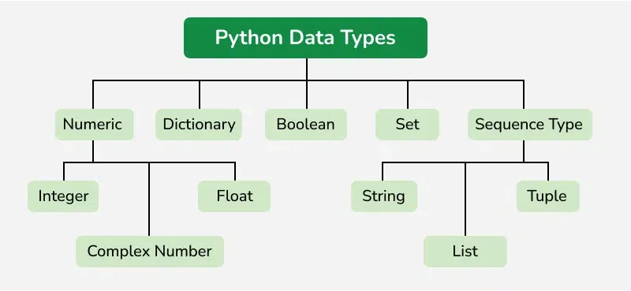

#### **Integer**

value is represented by int class. It contains positive or negative whole numbers (without fractions or decimals). There is no limit to how long an integer value can be.

**Example: 10, -20, 0, 1234567890**

#### **Float**

value is represented by float class. It contains positive or negative numbers with decimal points.

**Example: 3.14, -0.5, 2.0**

#### **String**

value is represented by str class. It contains a sequence of characters, such as letters, numbers, symbols, and spaces. Strings are enclosed in single quotes ('') or double quotes ("").

**Example: "Hello, World!", 'Python', '12345'**

#### **Boolean**

value is represented by bool class. It contains two possible values: True or False.

**Example: True, False**

### Type Casting

Type Casting is the method to convert the Python variable datatype into a certain data type in order to perform the required operation by users. In this article, we will see the various techniques for typecasting. There can be two types of Type Casting in Python:

- Implicit Type Casting
- Explicit Type Casting

#### **Implicit Type Casting**
Implicit type conversion occurs when Python automatically converts one data type to another during an operation to ensure correct and safe evaluation, without requiring any action from the user.

- **Example: 10 + 3.14 = 13.14 (int is implicitly converted to float)**

#### **Explicit Type Casting**
Explicit type conversion occurs when the user manually converts one data type to another using built-in functions or methods. This is done when the default implicit conversion is not desired or when the user wants to control the conversion process.

- **Example: int("10") = 10 (string is explicitly converted to int)**

### Operators

Operators are special symbols in Python that perform operations on variables and values. They are used to perform calculations, comparisons, and logical operations.

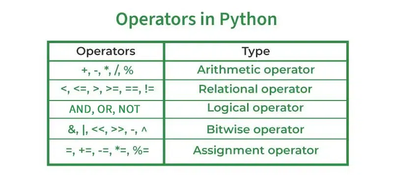

#### **Airthmetic Operators**

Python operators are fundamental for performing mathematical calculations. Arithmetic operators are symbols used to perform mathematical operations on numerical values. Arithmetic operators include addition (+), subtraction (-), multiplication (*), division (/), and modulus (%).

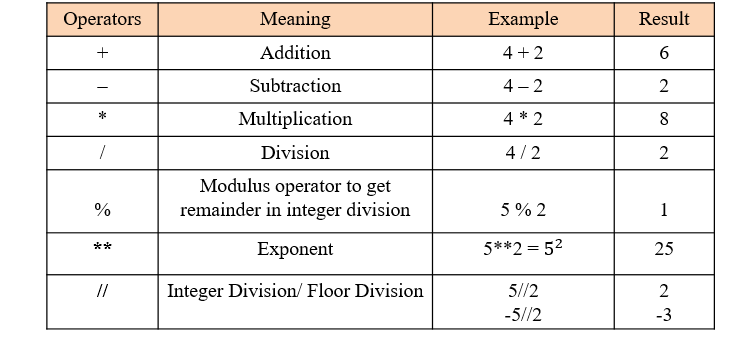

#### **Comparison Operators**

Comparison operators are used to compare two values and return a boolean result (True or False). They are used in conditional statements and loops to make decisions based on comparisons.

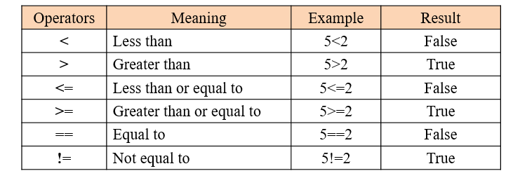

#### **Logical Operators**

Logical operators are used to combine multiple boolean expressions and return a boolean result. They are used in conditional statements and loops to make decisions based on multiple conditions.

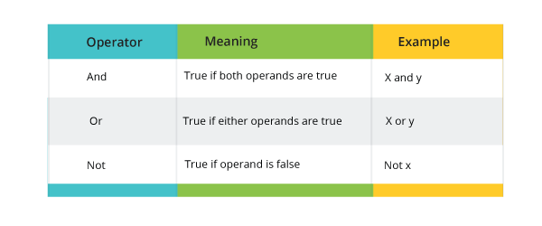

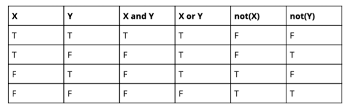

#### **Bitwise Operators**

Bitwise operators are used to perform operations on individual bits of binary numbers. They are used in low-level programming and cryptography.

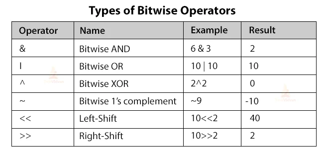

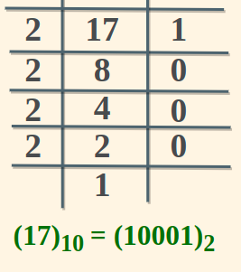
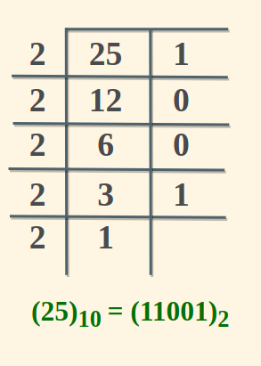

<table border="2px" style="padding: 10px; border:2px solid orange; border-collapse: collapse; font-size:25px;">
        <tr>
            <th style="padding: 10px; text-align:center;">Decimal</th>
            <th style="padding: 10px; text-align:center;">Binary</th>
        </tr>
        <tr>
            <td style="padding: 10px; text-align:center;">1</td>
            <td style="padding: 10px; text-align:center;">1</td>
        </tr>
        <tr>
            <td style="padding: 10px; text-align:center;">2</td>
            <td style="padding: 10px; text-align:center;">10</td>
        </tr>
        <tr>
            <td style="padding: 10px; text-align:center;">3</td>
            <td style="padding: 10px; text-align:center;">11</td>
        </tr>
        <tr>
            <td style="padding: 10px; text-align:center;">4</td>
            <td style="padding: 10px; text-align:center;">100</td>
        </tr>
        <tr>
            <td style="padding: 10px; text-align:center;">5</td>
            <td style="padding: 10px; text-align:center;">101</td>
        </tr>
        <tr>
            <td style="padding: 10px; text-align:center;">6</td>
            <td style="padding: 10px; text-align:center;">110</td>
        </tr>
        <tr>
            <td style="padding: 10px; text-align:center;">7</td>
            <td style="padding: 10px; text-align:center;">111</td>
        </tr>
        <tr>
            <td style="padding: 10px; text-align:center;">8</td>
            <td style="padding: 10px; text-align:center;">1000</td>
        </tr>
        <tr>
            <td style="padding: 10px; text-align:center;">9</td>
            <td style="padding: 10px; text-align:center;">1001</td>
        </tr>
        <tr>
            <td style="padding: 10px; text-align:center;">10</td>
            <td style="padding: 10px; text-align:center;">1010</td>
        </tr>
</table>

#### **Assignment Operators**

Assignment operators are used to assign values to variables. They are used in loops and other constructs to update variable values.

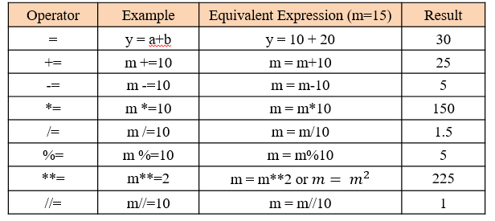

### Input and Output

Understanding input and output operations is fundamental to Python programming. With the print() function, we can display output in various formats, while the input() function enables interaction with users by gathering input during program execution.

#### **Input**

- **Print Strings in Python**
  
Python's input() function is used to take user input. By default, it returns the user input in form of a string.
name = input("Enter your name: ")

- **Print Numbers in Python**

The code prompts the user to input an integer representing the number of roses, converts the input to an integer using typecasting and then prints the integer value.
int(input("How many roses?: "))

- **Print Float or Decimal Number in Python**

The code prompts the user to input the price of each rose as a floating-point number, converts the input to a float using typecasting and then prints the price.
float(input("Price of each rose?: "))

#### **Output**

- name = input("Enter your name: ")
- print("Hello,", name, "! Welcome!")

**Output**
Hello, Akhilesh! Welcome

### Comments

Comments in Python are the lines in the code that are ignored by the interpreter during the execution of the program.

(# I am single line comment)

""" Multi-line comment used
print("Python Comments") """

### Practice

#### Calculator
#### Temperature Convertor
#### Simple Interest

<!-- If Elif Else -->
### If Elif Else

#### If Condition

- If statements are used to execute a block of code if a certain condition is true.

- These conditions can be used in several ways, most commonly in "if statements" and loops.

- An "if statement" is written by using the if keyword.

a = 33 
b = 200 
if b > a: 
    print("b is greater than a")

- The if statement evaluates a condition (an expression that results in True or False). If the condition is true, the code block inside the if statement is executed. If the condition is false, the code block is skipped.

#### Elif Condition

- The elif keyword is used to check multiple conditions. If the first condition is false, the elif condition is checked. If the elif condition is true, the code block inside the elif statement is executed. If the elif condition is false, the code block is skipped.

- The elif keyword is Python's way of saying "if the previous conditions were not true, then try this condition".

- The elif keyword allows you to check multiple expressions for True and execute a block of code as soon as one of the conditions evaluates to True.

a = 33 
b = 33 
if b > a: 
    print("b is greater than a") 
elif a == b: 
    print("a and b are equal") 

#### Else Condition

- The else keyword is used to execute a block of code if none of the previous conditions are true.

- The else keyword is Python's way of saying "if the previous conditions were not true, then do this".

a = 200 
b = 33 
if b > a: 
    print("b is greater than a") 
elif a == b: 
    print("a and b are equal") 
else: 
    print("a is greater than b") 

### Nested Conditions

- Nested conditions allow you to check multiple conditions within another condition. This means that you can have an "if" statement inside another "if" statement.

- You can have if statements inside if statements. This is called nested if statements.

x = 41 
if x > 10: 
    print("Above ten,") 
    if x > 20: 
        print("and also above 20!") 
    else: 
        print("but not above 20.")

### For Loop

- A for loop is used for iterating over a sequence (that is either a list, a tuple, a dictionary, a set, or a string).

- This is less like the for keyword in other programming languages, and works more like an iterator method as found in other object-orientated programming languages.

- With the for loop we can execute a set of statements, once for each item in a list, tuple, set etc.

names = "Akhilesh"  
for x in names: 
    print(x)

### While Loop
 
- With the while loop we can execute a set of statements as long as a condition is true. 

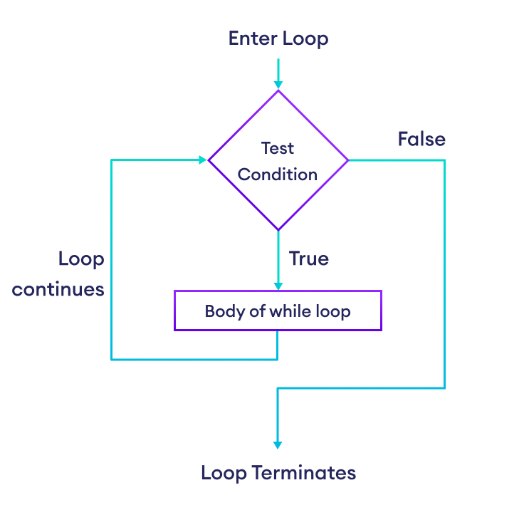  

<dt>i = 1</dt>
<dt>while i < 6:</dt>
<dd>print(i)</dd>
<dd>i += 1</dd>
     
- The while loop requires relevant variables to be ready, in this example we need to define an indexing variable, i, which we set to 1.
- With the break statement we can stop the loop even if the while condition is true: 

<dt>i = 1</dt>
<dt>while i < 6:</dt>
  <dd>print(i)</dd>
  <dd>if (i == 3):</dd>
    <dd>break</dd>
  <dd>i += 1</dd>
 
- With the continue statement we can stop the current iteration, and continue with the next:
<dt>i = 0</dt>
<dt>while i < 6:</dt>
  <dd>i += 1</dd>
  <dd>if i == 3:</dd>
    <dd>continue</dd>
  <dd>print(i)</dd>
  
- With the else statement we can run a block of code once when the condition no longer is true:
<dt>i = 1</dt>
<dt>while i < 6:</dt>
  <dd>print(i)</dd>
  <dd>i += 1</dd>
  <dd>else:</dd>
    <dd>print("i is no longer less than 6")</dd>  
